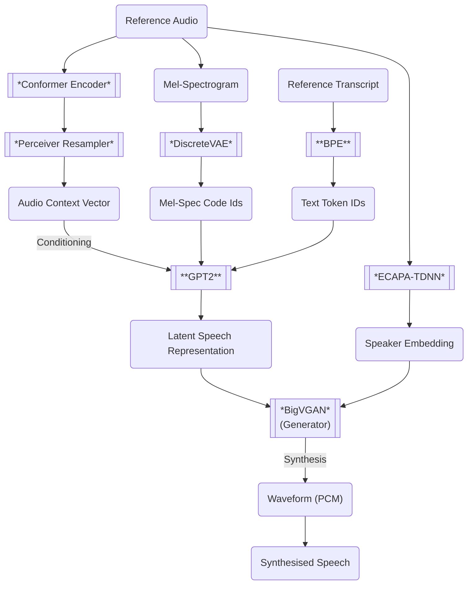

# IndexTTS Fine-tuning Demo

[中文说明](README_zh.md)

This project is a demonstration of fine-tuning [IndexTTS](https://github.com/index-tts/index-tts) to generate speech with addtional special tags (such as `<GIGGLES>`), enabling the synthesis of non-textual elements like laughter.

## Goals

- Show you how to fine-tune IndexTTS's text Tokenizer (BPE) and AR part (GPT2).
- Support for addtional special tags like `<GIGGLES>` in text to generate laughter.

### Fine-tuning Experiment Results Example

| Reference Audio | Text | Synthesized Speech |
| --- | --- | --- |
| [Female-1][Female_1]| Seriously? &lt;giggles> That's the cutest thing I've ever heard! | [Synthesized Speech](samples/Female-1_SeriouslygigglesThatsthecutestt.wav) |
| [Female-1][Female_1] | 真的吗？ &lt;giggles> 这也太可爱了吧！| [Synthesized Speech](samples/Female-1_真的吗giggles这也太可爱了吧.wav) |
| [Male-1][Male_1]| Wha—? Cute? &lt;giggles> You think I'm cute?! Well, uh, thanks, I guess? | [Synthesized Speech](samples/Male-1_Wha—CutegigglesYouthinkImcute.wav) |
| [Male-1][Male_1]| 哎呀! 忘了他还在那等我们呢！&lt;giggles> 我们两个动作得快点了！| [Synthesized Speech](samples/Male-1_哎呀忘了他还在那等我们呢giggles我们两个动作得快点了.wav) |

### IndexTTS Architecture Overview

### Modules Fine-tuned in This Project

- **BPE**: Actually `sentencepiece`, this project implements adding new special tags such as `<GIGGLES>`
- **GPT2**: The autoregressive model part, using the `peft` library for `LoRA` fine-tuning, supporting the generation of speech latents for text with special tags

## Disclaimer

The reference audio files and the datasets used in this project are granted under the [CC BY-NC-SA 4.0](https://creativecommons.org/licenses/by-nc-sa/4.0/) license.
They are used for the research and demonstration purposes of this project only, and are not intended for any commercial use.
The synthesized audio files generated by this project are also not intended for commercial use.

[Female_1]: https://bytedancespeech.github.io/seedtts_tech_report/audios/SpeechFactorization_samples/prompt/prompt1/4813840990459345930.wav
[Male_1]: https://bytedancespeech.github.io/seedtts_tech_report/audios/SpeechFactorization_samples/source/2188769758301752050.wav

## License

This project is licensed under the [MIT License](LICENSE).