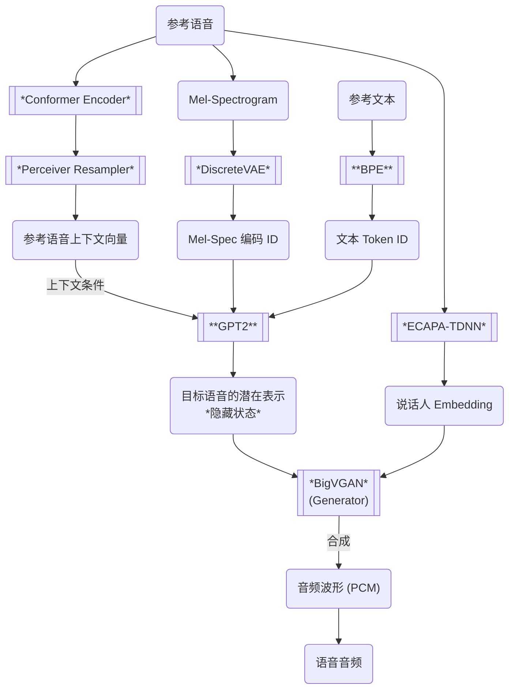

# IndexTTS 微调示例

[English Version](README.md)

本项目是个示例项目，旨在对 [IndexTTS](https://github.com/index-tts/index-tts) 进行微调，使其能够识别并生成带有特殊标签（如 `<GIGGLES>`）的语音音频，实现如笑声等情感或非文本元素的合成。

> [!NOTE]
> 本项目仅为示例，实际应用中请根据具体需求进行调整和优化。

## 项目目标

- 示例如何对 IndexTTS 的文本 Tokenizer和自回归模型部分（GPT2）进行微调
- 支持在文本中插入如 `<GIGGLES>` 等特殊标签，以生成对应的笑声或其他音效。

### 微调实验结果示例

| 参考音频 | 文本 | 语音 |
| --- | --- | --- |
|[Female-1][Female_1]| Seriously? &lt;giggles> That's the cutest thing I've ever heard! | [Synthesized Speech](samples/Female-1_SeriouslygigglesThatsthecutestt.wav) |
| [Female-1][Female_1] | 真的吗？ &lt;giggles> 这也太可爱了吧！| [Synthesized Speech](samples/Female-1_真的吗giggles这也太可爱了吧.wav) |
| [Male-1][Male_1]| Wha—? Cute? &lt;giggles> You think I'm cute?! Well, uh, thanks, I guess? | [Synthesized Speech](samples/Male-1_Wha—CutegigglesYouthinkImcute.wav) |
| [Male-1][Male_1]| 哎呀! 忘了他还在那等我们呢！&lt;giggles> 我们两个动作得快点了！| [Synthesized Speech](samples/Male-1_哎呀忘了他还在那等我们呢giggles我们两个动作得快点了.wav) |

### IndexTTS 模型架构

### 本项目微调的模块

- **BPE**: 实际为 `sentencepiece`，本项目实现增加新的特殊标签，如 `<GIGGLES>`
- **GPT2**: 自回归模型部分，使用 `peft` 库进行`LoRA`微调，支持生成带有特殊标签文本的语音 Latent

## Disclaimer

The reference audio files and the datasets used in this project are granted under the [CC BY-NC-SA 4.0](https://creativecommons.org/licenses/by-nc-sa/4.0/) license.
They are used for the research and demonstration purposes of this project only, and are not intended for any commercial use.
The synthesized audio files generated by this project are also not intended for commercial use.

[Female_1]: https://bytedancespeech.github.io/seedtts_tech_report/audios/SpeechFactorization_samples/prompt/prompt1/4813840990459345930.wav
[Male_1]: https://bytedancespeech.github.io/seedtts_tech_report/audios/SpeechFactorization_samples/source/2188769758301752050.wav

